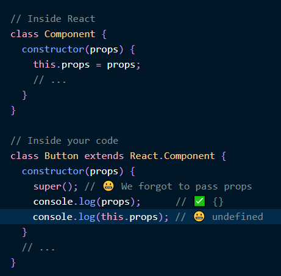

---
title: '클래스형 컴포넌트에서 super(props)를 쓰는 이유'
date: '2019-05-16'
spoiler: '클래스형 컴포넌트에서 super(props)를 쓰는 이유에 관한 글'
tags: ['react']
--- 

###super 키워드###

`super` 키워드는 자바스크립트 클래스에서 부모 오브젝트에 선언된 함수나 변수 를 호출할 때 사용 된다.

부모 클래스의 생성자에 값을 전달한다 `super(값,값,...)` 
부모에 선언된 변수를  `this .부모변수이름` 으로 이용 가능하다.  또 부모에 선언된 함수도 `super.함수()` 로 쓸 수 있다

###리액트에서의 super 키워드 ###

생성자 초기화시 Button이 `super(props)`해줘야 부모인 Compoent의 변수 `props` 에다가 할당을 하고 부모 변수 `this.props`써서 이용가능
(_props나 state나 부모변수에 선언된 변수들_)

자식의 생성자에서 `this`를 쓰게 할수 있게 해준다. 

`this`는 해당 큰 객체를 의미 한다고 생각 하면 될 듯하다.

필요하다면 `클래스 필드 문법`으로 `state={}` 같은것 쓰게 되면 `this.props`, `this.context` 모두 자동적으로 생성자에 레퍼런스된다.

안쓰고 `render ()`에서 `this.props`써도 작동 하긴 한다. 생성자가 올바르게 불려진후 props를 불러온다. _리액트에서는 단순 클래스로서의 지원 뿐만 아니라 넓은 의미의 추상화까지 생각하고 클래스 문법을 추가했다._ 하지만 리액트는 의도적으로 `super(props)`작성을 요구 하고있다.

요구하는 이유는 생성자에 `super(props)`를 쓰지 않게되면 _클래스형 컴포넌트에서 디버깅이 어려워 질 수도 있기 때문_ 이다. 안쓰면 위와 같이 `undefined`가 되는 경우가 발생하게된다.

`super(props)`를 쓰게되면 constructor의 사이클이 끝나기 전에 `this.props`가 생성되는 것을 보장한다 

`Hooks`를 쓰면 이런 고민이 사라진다!

**참고글**  
[overreacted.io](https://overreacted.io/why-do-we-write-super-props/)